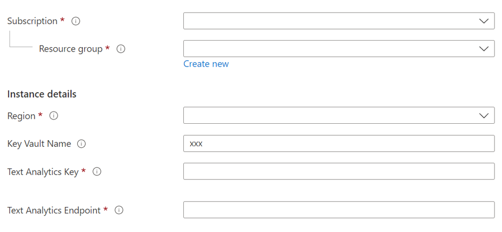

# Deployment Guide 
Please follow the steps below to set up the Azure environment

## Step 1: Download Files
Clone or download this repository and navigate to the project's root directory.

## Step 2: Security Access
### Step 2.1: Add Azure Synapse to Azure Key Vault 
1. Go to the Key Vault that was created in the previous step 
2. Click `Access policies`, click `+ Create`, under "Secret permissions" select `Get` and `List` and click `Next`
3. Search for your Synapse Workspace name to be added to the Key vault and click `Next` 
4. Select "Review + create" and save the changes made.
    * Repeat steps 2-4 to add grant yourselft `Get`, `List` and `Set` permissions 

### Step 2.2 Add Secrets to Azure Key Vault
The button below will deploy secrets into the Azure Key Vault you are using for this solution:

[](https://portal.azure.com/#create/Microsoft.Template/uri/https%3A%2F%2Fraw.githubusercontent.com%2Fmicrosoft%2FAzure-Employee-Network-Graph-Solution-Accelerator-with-MGDC%2Fmain%2FDeployment%2Fdeploykeyvault.json)


Populate the variables accordingly:
1. **Resource group**: Use the `same resource group` where the previous ARM template was deployed.
2. **Region**: This field will be auto-filled in 
3. **Key Vault Name**: The name of the Azure Key Vault that was created during previous steps
4. **Text Analytics Key**: The key for your Text Analytics resource that was created in previous steps
5. **Text Analytics Endpoint**: The endpoint for your Text Analytics resource that was created in previous steps
6. **Text Analytics Region**: The region your Text Analytics resource is in


### Step 2.3: Add your IP address to Synapse firewall
Before you can upload assests to the Synapse Workspace you will need to add your IP address:
1. Go to the Synapse resource you created in the previous step. 
2. Navigate to `Networking` under `Security` on the left hand side of the page.
3. At the top of the screen click `+ Add client IP`
      
4. Your IP address should now be visible in the IP list

### Step 2.4: Update storage account permisions 
In order to perform the necessary actions in the Synapse workspace, you will need to grant more access.
1. Go to the Azure Data Lake Storage Account for your Synapse Workspace
2. Go to the `Access Control (IAM) > + Add > Add role assignment` 
3. Now search and select the `Storage Blob Data Contributor` role and click "Next" 
4. Click "+ Select members", search and select your username and click "Select" 
5. Click `Review and assign` at the bottom

[Learn more](https://docs.microsoft.com/azure/synapse-analytics/security/how-to-set-up-access-control)


# Step 3: Upload Sample Dataset
> **Note**: To connect the solution with your Office 365 data, follow the [Deployment_M365 Guide](./Deployment_M365.md) to set up the linked services and pipelines. If you would like to see how the solution works with the sample dataset, continue with the steps below. 

## Step 3.1: Get Sample Data
We are using data provided by [Data World](https://data.world/brianray/enron-email-dataset), and you will need to download the data to your local machine. You will need the following [dataset](https://data.world/brianray/enron-email-dataset/file/enron_05_17_2015_with_labels_v2.csv.zip). (download the data)

1. Launch the Synapse workspace [Synapse Workspace](https://ms.web.azuresynapse.net/)
2. Select the `subscription` and `workspace` name you are using for this solution accelerator
3. In Synapse Studio, navigate to the `Data` Hub
4. Select `Linked`
5. Under the category `Azure Data Lake Storage Gen2` you'll see an item with a name like `xxxxx(xxxxx- Primary)`
6. Select the container named `employeegraphadlsfs (Primary)`, select "New folder", enter `enrondata` and select "Create", select `Upload` to upload the dataset downloaded from [Data World](https://data.world/brianray/enron-email-dataset) to the `enrondata` folder you created

# Step 4: Upload Assets and Run Noteboks
> **Note**: if you are using the sample [Enron dataset](https://data.world/brianray/enron-email-dataset/file/enron_05_17_2015_with_labels_v2.csv.zip) you will only need the following notbeook. If you are running this solution with your own Office 365 data, follow the steps in the [Deployment_M365 Guide](./Deployment_M365.md) to load the necessary noteboooks. 


## Step 4.1: Upload Required Packages
1. Launch the Synapse workspace [Synapse Workspace](https://ms.web.azuresynapse.net/)
2. Go to `Manage` tab in the Studio and click on the `Apache Spark pools`  

5. Click `...` on the deployed Spark Pool and select `Packages`
6. Click `Upload` and select `requirements.txt` from the cloned repo.
    - Go to `Analytics_Deployment\synapse-workspace\cluster_config` to get the requirements.txt for upload  
7. Click `Apply`

8. Now the environment should be ready to go for the execution of the scripts  


1. Launch the Synapse workspace [Synapse Workspace](https://ms.web.azuresynapse.net/)
2. Go to `Develop`, click the `+`, and click `Import` to select the `Employee_Network_Graph_DataProcessing.ipynb` notebooks from this repository's [folder](https://github.com/microsoft/Azure-Employee-Network-Graph-Solution-Accelerator-with-MGDC/main/Code/Notebooks)
3. Update the following parameters in `Employee_Network_Graph_DataProcessing.ipynb`, attach a Spark pool to the notebook and publish the changes 
    ```
    data_lake_account_name = ''
    file_system_name = ''
    # name of the secret in key vault for your text analytics key
    text_analytics_Key = ''
    # name of the secret in key vault for your text analytics endpoint
    text_analytics_endpoint = ''
    # name of the secret in key vault for your text analytics region
    text_analytics_region = '' 
    keyvault_name = ''
    KeyVaultLinkedServiceName = ''
    ```
4. Run the notebook `Employee_Network_Graph_DataProcessing.ipynb`
> **Note**: We are running entity extraction for only first 100 messages to save cost and time for the initial deployment. Please update the code to run for all messages if needed. 

## Step 5: Power BI Set Up 
1. Open the [Power BI report](https://github.com/microsoft/Azure-Employee-Network-Graph-Solution-Accelerator-with-MGDC/main/PowerBI/EmployeeNetworkGraph.pbix) in this repository

2. Click the Transform data dropdown and click Data source settings 


3. Select the Azure Synapse Workspace connection, select `Change Source...` and provide your SQL Server Database name under Server and click `OK`
    * Navigate to the Synapse Workspace overview page in the Azure Portal, copy the Serverless SQL endpoint
4. Select `Edit Permissions`, under Credentials select `Edit`, sign in to your Microsoft Account, click "OK" and click "Close"
5. Select `Refresh`
