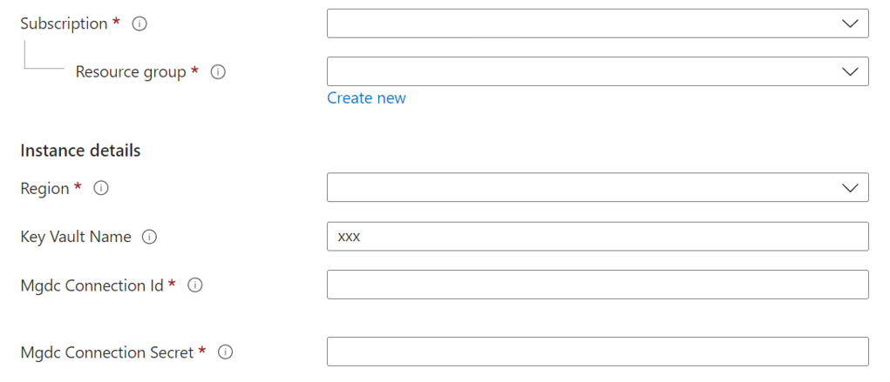

## Step 1: Prerequisites 
To use this solution accelerator, you will need access to an [Azure subscription](https://azure.microsoft.com/free/), Microsoft 365 account and Microsoft Graph Data Connect(MGDC) enabled. If you do not have this please follow the [Prerequisites Guide](./Prerequisites.md). While not required, a prior understanding of Microsoft Graph Data Connect, and Azure Synapse Analytics will be helpful.

## Step 2: Set up Pipelines
> This step is an optional to connect to your Office 365 account. If you are using the sample dataset from this repository, skip this step

### Step 2.1: Update storage account permissions 
In order to perform the necessary actions in the Synapse workspace, you will need to grant more access.
1. Go to the Azure Data Lake Storage Account for your Synapse Workspace
2. Go to the `Access Control (IAM) > + Add > Add role assignment` 
3. Now search and select the `Storage Blob Data Contributor` role and click "Next" 
4. Click "+ Select members", search and select your mgdc-spn created in previous steps of the [Prerequisites Guide](./Prerequisites.md) and click "Select" 
5. Click `Review and assign` at the bottom

[Learn more](https://docs.microsoft.com/azure/synapse-analytics/security/how-to-set-up-access-control)


### Step 2.2: Add Azure Synapse to Azure Key Vault 
> **Note**: You can skip this step and move to Step 2.3 if you completed this during Step 2 of the [Deployment Guide](./Deployment.md)

1. Go to the Key Vault that was created in the previous step 
2. Click `Access policies`, click `+ Create`, under "Secret permissions" select `Get` and `List` and click `Next`
3. Search for your Synapse Workspace name to be added to the Key vault and click `Next` 
4. Select "Review + create" and save the changes made.
    * Repeat steps 2-4 to add grant yourselft `Get`, `List` and `Set` permissions 

### Step 2.3 Add Secrets to Azure Key Vault
The button below will deploy secrets into the Azure Key Vault you are using for this solution:

[](https://portal.azure.com/#create/Microsoft.Template/uri/https%3A%2F%2Fraw.githubusercontent.com%2Fmicrosoft%2FAzure-Employee-Network-Graph-Solution-Accelerator-with-MGDC%2Fmain%2FDeployment%2Fdeploykeyvaultm365.json)


Populate the variables accordingly:
1. **Resource group**: Use the `same resource group` where the previous ARM template was deployed.
2. **Region**: This field will be auto-filled in 
3. **Key Vault Name**: The name of the Azure Key Vault that was created during previous steps
4. **mgdc-service-principal Id**: The Client Id for your mgdc-service-principal that was created in previous steps in the [Prerequisites](./Prerequisites.md)
5. **mgdc-service-principal Secret**: The secret for your mgdc-service-principal that was created in previous steps in the [Prerequisites](./Prerequisites.md)

### Step 2.4: Create Linked Service 
1. Launch the Synapse workspace [Synapse Workspace](https://ms.web.azuresynapse.net/)
2. Select the `subscription` and `workspace` name you are using for this solution accelerator
3. Navigate to the `Manage` Hub, under "External connection" click `Linked services`
4. Click `+ New`, select `Azure Key Vault`, select the subscription you are using for this solution from the "Azure Subscription" dropdown, and select your Azure Key Vault name from the "Azure key vault name" dropdown
5. Click "Test connection" and click "Save"
6. Click `+ New`, select `Office 365`, provide your `Microsoft Graph data connect Data Transfer` Service principal Id and select `Azure Key Vault`
7. Under "AKV Linked Service" select your Azure Key Vault Linked Service from the dropdown, under "Secret name" select your `Microsoft Graph Data Connect secret`, and under "Secret version" select `Latest version`
8. Click "Test connection" and click "Save" 
9. Click `+ New`, select `Azure Data Lake Storage Gen2`, under "Authentication type" select `Service Princlipal`, provide your `Microsoft Graph Data Connect` Service Principal Id and select `Azure Key Vault`
10. Under "AKV Linked Service" select your Azure Key Vault Linked Service from the dropdown, under "Secret name" select your `Microsoft Graph Data Connect secret`, and under "Secret version" select `Latest version`
11. Select the subscription you are using for this solution from the "Azure Subscription" dropdown and select your storage account name from the "Storage account name" dropdown. 
12. Click "Test connection" and click "Save"
13. Publish all changes

### Step 2.5: Upload Notebooks 
1. Launch the Synapse workspace [Synapse Workspace](https://ms.web.azuresynapse.net/)
2. Select the `subscription` and `workspace` name you are using for this solution accelerator
3. Select the `Develop` tab, select `+ New`  and select "Import"
4. Select the following 7 notebooks from this [repository](./code/notebooks)
    * `Add_Members_To_InitialLoad_Usergroup.ipynb`
    * `ProcessO365Data_Users_Mailfolders.ipynb`
    * `Get_Messages_Last_Run_Date.ipynb`
    * `Get_Events_Last_Run_Date.ipynb`
    * `ProcessO365Data_Events.ipynb`
    * `ProcessO365Data_Messages.ipynb`
    * `Copy_Members_From_Initial_To_Delta_Group.ipynb`

### Step 2.3: Update O365 Data Load Messages and Events Pipeline Parameters 

1. Go to the [Azure Portal](portal.azure.com), select the cloud shell in the top right and run the following command to clone the repository 

```
git clone https://github.com/microsoft/Azure-Employee-Network-Graph-Solution-Accelerator-with-MGDC.git
```
2. In the following command replace `<Synapse-workspace-name>` with the name of your Synapse workspace you are using for this solution and run the command
```
synapse_name=<Synapse-workspace-name>

cd Azure-Employee-Network-Graph-Solution-Accelerator-with-MGDC
```

3. In the following command replace `<allowed-group-security-group-id>` with the id of your security group for the users you will pull Office 365 data for that was created in [Step 3 of the Prerequisites](./Prerequisites.md) and run the command 
    > Go to Azure Active Directory in the portal and search for the security group name for the allowed users group and copy the Object Id
```
allowed_group=<allowed-group-security-group-id>
```

4. The following commands will create the dataset connections and pipeline for your Office 365 account in your Synapse workspace. Run each command in the cloud shell 

```
sed -i "s/<allowed-group-security-group-id>/$allowed_group/g" Code/Pipelines/o365dataloadmessages/pipeline/o365dataloadmessages.json 

az synapse dataset create --workspace-name $synapse_name --name ADLSMessages --file @Code/Pipelines/o365dataloadmessages/dataset/ADLSMessages.json

az synapse dataset create --workspace-name $synapse_name --name Office365Messages --file @Code/Pipelines/o365dataloadmessages/dataset/Office365Messages.json

az synapse pipeline create --workspace-name $synapse_name --name o365dataloadmessages --file @Code/Pipelines/o365dataloadmessages/pipeline/o365dataloadmessages.json

az synapse pipeline create --workspace-name $synapse_name --name o365dataloadmessages_wrapper --file @Code/Pipelines/o365dataloadmessages/pipeline/o365dataloadmessages_wrapper.json

sed -i "s/<allowed-group-security-group-id>/$allowed_group/g" Code/Pipelines/o365dataloadevents/pipeline/o365dataloadevents.json 

az synapse dataset create --workspace-name $synapse_name --name ADLSEvents --file @Code/Pipelines/o365dataloadevents/dataset/ADLSEvents.json

az synapse dataset create --workspace-name $synapse_name --name Office365Events --file @Code/Pipelines/o365dataloadevents/dataset/Office365Events.json

az synapse pipeline create --workspace-name $synapse_name --name o365dataloadevents --file @Code/Pipelines/o365dataloadevents/pipeline/o365dataloadevents.json

az synapse pipeline create --workspace-name $synapse_name --name o365dataloadevents_wrapper --file @Code/Pipelines/o365dataloadevents/pipeline/o365dataloadevents_wrapper.json


sed -i "s/<allowed-group-security-group-id>/$allowed_group/g" Code/Pipelines/o365dataloadmailfolder/pipeline/o365dataloadmailfolder.json 

az synapse dataset create --workspace-name $synapse_name --name ADLSMailFolder --file @Code/Pipelines/o365dataloadmailfolder/dataset/ADLSMailFolder.json

az synapse dataset create --workspace-name $synapse_name --name Office365MailFolder --file @Code/Pipelines/o365dataloadmailfolder/dataset/Office365MailFolder.json

az synapse pipeline create --workspace-name $synapse_name --name o365dataloadmailfolder --file @Code/Pipelines/o365dataloadmailfolder/pipeline/o365dataloadmailfolder.json


sed -i "s/<allowed-group-security-group-id>/$allowed_group/g" Code/Pipelines/o365dataloadUsers/pipeline/o365dataloadUsers.json 

az synapse dataset create --workspace-name $synapse_name --name ADLSUsers --file @Code/Pipelines/o365dataloadUsers/dataset/ADLSUsers.json

az synapse dataset create --workspace-name $synapse_name --name Office365Users --file @Code/Pipelines/o365dataloadUsers/dataset/Office365Users.json

az synapse pipeline create --workspace-name $synapse_name --name o365dataloadUsers --file @Code/Pipelines/o365dataloadUsers/pipeline/o365dataloadUsers.json

az synapse pipeline create --workspace-name $synapse_name --name o365dataload_all_wrapper --file @Code/Pipelines/o365dataload_all_wrapper/pipeline/o365dataload_all_wrapper.json
```

### Step 2.4: Run the Pipelines 
1. Launch the Synapse workspace [Synapse Workspace](https://ms.web.azuresynapse.net/)
2. Select the `subscription` and `workspace` name you are using for this solution accelerator
3. Select the `Integrate` hub and click on the `o365dataload_all_wrapper` pipeline
4. Select `Add trigger` and click `Trigger now`
6. Once the pipeline runs have started, ask one of your admins to approve the requests from the [Microsoft 365 Admin Portal](https://portal.office.com/adminportal/home#/Settings/PrivilegedAccess) Privileged access requests, select the request, and click "Approve" for the following pipelines: 
    * o365dataloadUsers
    * o365dataloadMailFolder
    * o365dataloadMessages
    * o365dataloadEvents
